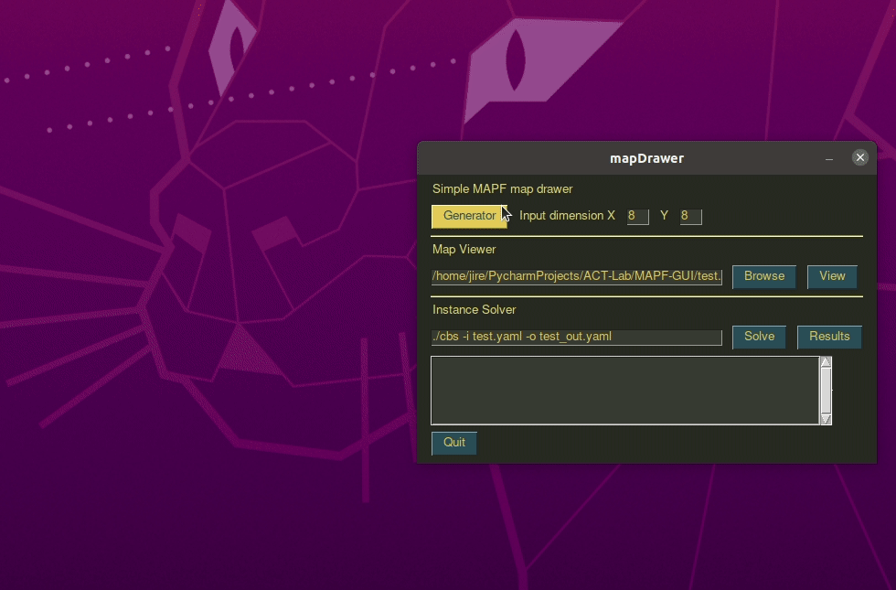

This is a simple GUI interface which helps to draw simple MAPF instance in yaml file.




To install the required packages:

```pip install -r requirements.txt```

To run the mapDrawer:

```python3 mapDrawer.py```

The generated yaml maps can be used directly by the solvers of [libMultiRobotPlanning](https://github.com/whoenig/libMultiRobotPlanning).

Known bugs/issues:
* running the `mapDrawer.py` in `conda` environment will cause very slow loading speed of the GUI interface. Probably caused by the performance issue of `PySimpleGUI` package. Try to use native python interpreter or other venv to avoid this problem.
* can't have start/goal at the same location atm.